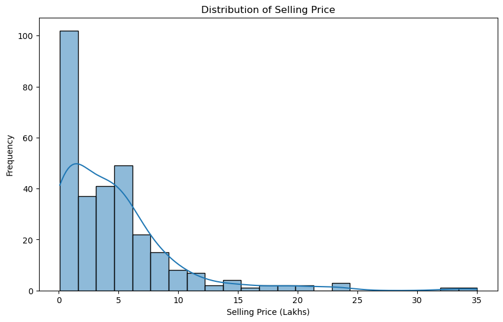
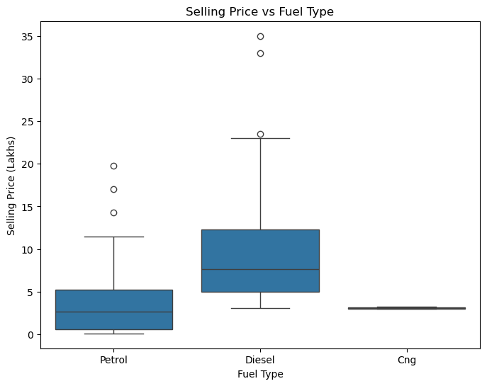
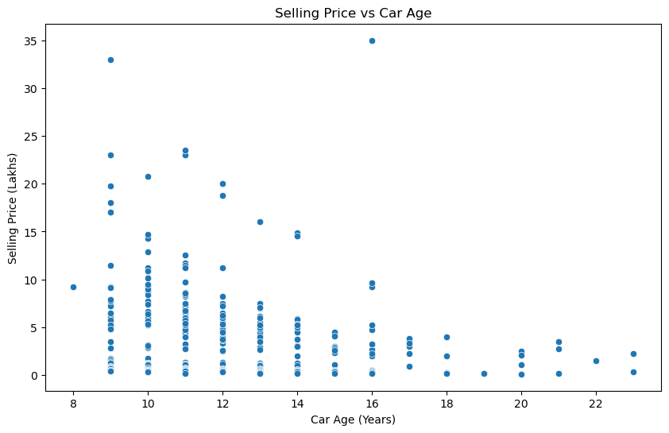
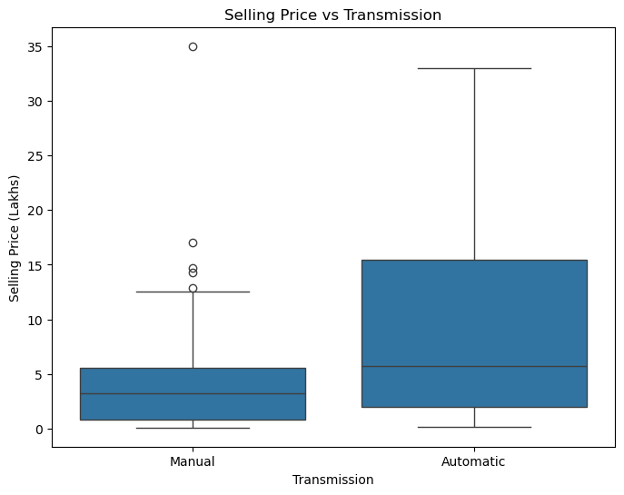
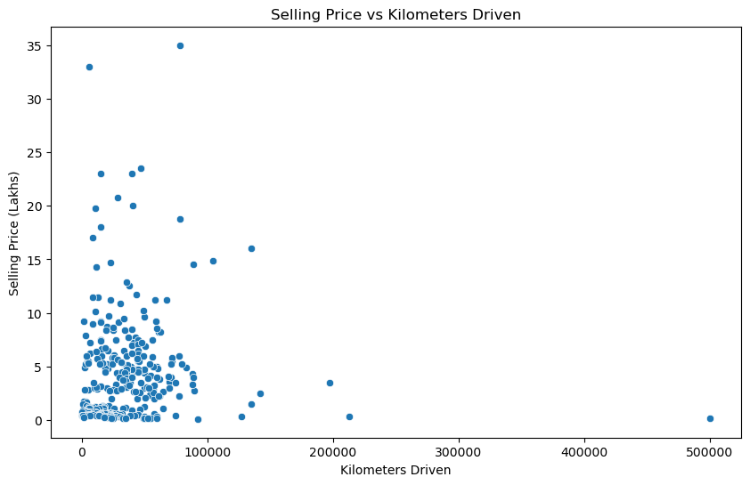
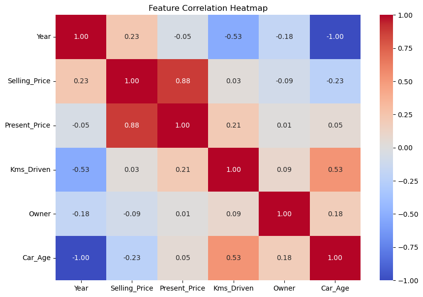
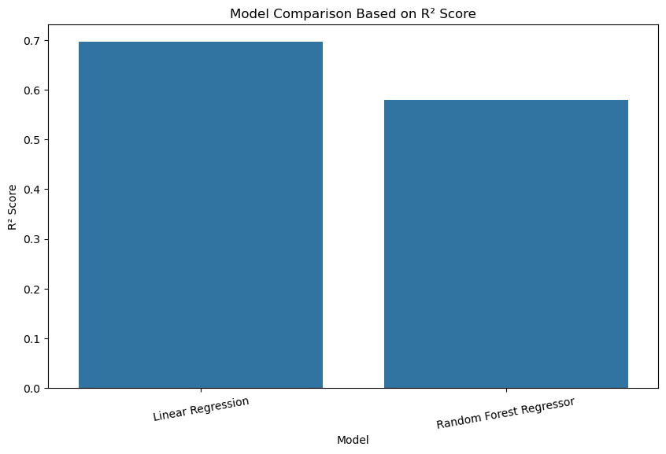
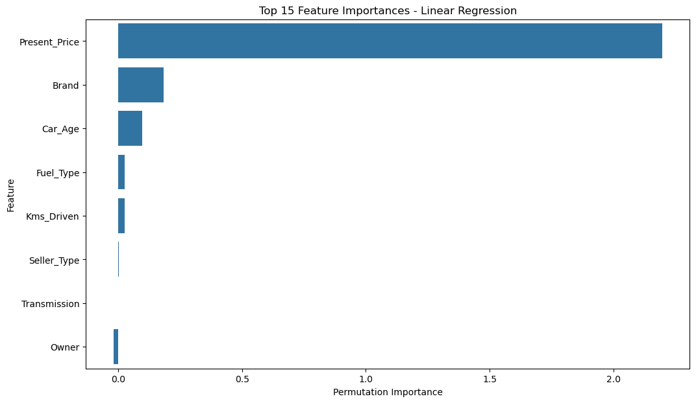
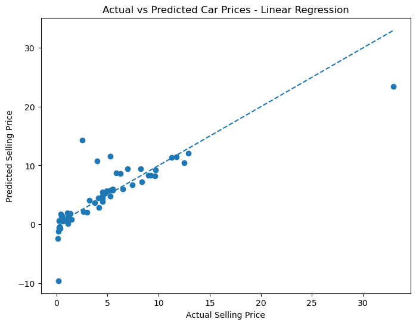

# 🚗 Car Price Prediction with Machine Learning

<div align="center">

Predicting the selling price of used cars using Machine Learning regression techniques.

<br>


</div>

---

## 📌 Project Overview

This project is part of the **Oasis Infobyte Data Science Internship — Task 3**.

The goal of this project is to build a Machine Learning regression model that predicts the **selling price of used cars** based on different vehicle characteristics such as present price, kilometers driven, fuel type, transmission, seller type, ownership, car age, and brand.

The project covers the complete Machine Learning workflow, starting from data preprocessing and exploratory data analysis to model training, evaluation, and feature importance analysis.

---

## 🎯 Objective

The main objectives of this project are:

- Clean and preprocess the car price dataset.
- Handle missing values and duplicate records.
- Standardize categorical variables.
- Perform feature engineering.
- Calculate the age of each car.
- Extract the car brand from the car name.
- Perform Exploratory Data Analysis (EDA).
- Encode categorical features using One-Hot Encoding.
- Train multiple regression models.
- Compare model performance using MAE, RMSE, and R² Score.
- Identify the best-performing model.
- Analyze important features affecting car prices.

---


## 📂 Dataset

The project uses the **Vehicle Dataset from CarDekho**, which contains information about used cars and their selling prices.

### Features

| Feature | Description |
|---|---|
| `Car_Name` | Name/model of the car |
| `Year` | Manufacturing year |
| `Selling_Price` | Selling price — Target variable |
| `Present_Price` | Current market price |
| `Kms_Driven` | Kilometers driven |
| `Fuel_Type` | Fuel type of the car |
| `Seller_Type` | Dealer or Individual |
| `Transmission` | Manual or Automatic |
| `Owner` | Number of previous owners |

### Dataset Information

- **Original records:** 301
- **Duplicate records removed:** 2
- **Final records:** 299
- **Target variable:** `Selling_Price`

---

## 🔄 Project Workflow

```text
Dataset
   ↓
Data Understanding
   ↓
Data Cleaning
   ↓
Feature Engineering
   ↓
Exploratory Data Analysis
   ↓
One-Hot Encoding
   ↓
Train/Test Split
   ↓
Model Training
   ↓
Model Evaluation
   ↓
Model Comparison
   ↓
Best Model Selection
   ↓
Feature Importance
```
## 🧹 Data Cleaning

The dataset was inspected and cleaned before building the Machine Learning models.

### Cleaning Steps

- Checked dataset structure and data types.
- Checked missing values.
- Checked duplicate records.
- Removed duplicate records.
- Reset the DataFrame index.
- Checked categorical value distributions.
- Standardized categorical values using `.strip()` and `.title()`.

### Cleaning Results

| Check | Result |
|---|---:|
| Original Records | 301 |
| Missing Values | 0 |
| Duplicate Records | 2 |
| Final Records | 299 |

The dataset contained **no missing values**. Two duplicate records were identified and removed before further analysis.

---

## ⚙️ Feature Engineering

Feature engineering was performed to create additional information that could help the regression models predict car prices.

### 1. Car Age

The age of each car was calculated from its manufacturing year.

**Formula:**

`Car_Age = 2026 - Year`

This converts the original `Year` feature into a more meaningful feature representing the current age of the vehicle.

### 2. Brand Extraction

The first word from the `Car_Name` column was extracted and stored as a new `Brand` feature.

For example:

| Car Name | Extracted Brand |
|---|---|
| ritz | ritz |
| sx4 | sx4 |
| ciaz | ciaz |
| wagon r | wagon |
| swift | swift |

The new `Car_Age` and `Brand` features were then used during model training.

---

## 📊 Exploratory Data Analysis

Exploratory Data Analysis (EDA) was performed to understand the distribution of selling prices and the relationship between important vehicle features and the target variable.

### Selling Price Distribution

The distribution of `Selling_Price` was visualized using a histogram with a KDE curve.



### Selling Price vs Fuel Type

A box plot was used to compare selling prices across different fuel types.



### Selling Price vs Car Age

A scatter plot was created to analyze the relationship between car age and selling price.



### Selling Price vs Transmission

A box plot was used to compare the selling prices of manual and automatic vehicles.



### Selling Price vs Kilometers Driven

A scatter plot was used to understand the relationship between kilometers driven and selling price.



---

## 🔥 Feature Correlation

A correlation heatmap was created using the numerical features to understand relationships between variables.



### Key Observation

`Present_Price` showed the strongest positive correlation with `Selling_Price`, with a correlation of approximately **0.88**.

This indicates that the current market price of a vehicle is one of the most important factors associated with its resale price.

---

## 🔤 Data Preprocessing

Before training the models, the dataset was divided into numerical and categorical features.

### Categorical Features

- `Fuel_Type`
- `Seller_Type`
- `Transmission`
- `Brand`

### Numerical Features

- `Present_Price`
- `Kms_Driven`
- `Owner`
- `Car_Age`

### One-Hot Encoding

Categorical variables were converted into numerical representations using **One-Hot Encoding**.

The encoder was configured with `handle_unknown='ignore'` so that unseen categories during prediction do not cause errors.

A `ColumnTransformer` was used to apply encoding only to categorical columns while keeping numerical features unchanged.

---

## ✂️ Train/Test Split

The dataset was divided into training and testing sets using an **80/20 split**.

| Dataset | Percentage |
|---|---:|
| Training Data | 80% |
| Testing Data | 20% |
| Random State | 42 |

The training data was used to build the regression models, while the testing data was used to evaluate their performance on unseen records.

---

## 🤖 Machine Learning Models

Two regression models were trained and compared.

### 1. Linear Regression

Linear Regression was used as the baseline regression model.

It attempts to model the relationship between the input features and the target selling price using a linear relationship.

### 2. Random Forest Regressor

Random Forest Regressor was used as a second model because it can capture non-linear relationships and interactions between different vehicle features.

The Random Forest model was configured with:

| Parameter | Value |
|---|---:|
| `n_estimators` | 300 |
| `random_state` | 42 |

---

## 📏 Model Evaluation

The models were evaluated using three regression metrics.

### MAE — Mean Absolute Error

MAE measures the average absolute difference between the actual and predicted selling prices.

**Lower MAE indicates better performance.**

### RMSE — Root Mean Squared Error

RMSE measures the prediction error while giving greater importance to larger errors.

**Lower RMSE indicates better performance.**

### R² Score — Coefficient of Determination

R² Score represents the proportion of variation in the target variable that is explained by the model.

**Higher R² indicates better performance.**

---

## 🏆 Model Performance

The performance of both regression models was compared using MAE, RMSE, and R² Score.

| Model | MAE | RMSE | R² Score |
|---|---:|---:|---:|
| **Linear Regression** | 1.474 | **2.796** | **0.697** |
| Random Forest Regressor | **1.370** | 3.291 | 0.580 |

### Model Comparison



### Result

Random Forest achieved a slightly lower **MAE**, but Linear Regression achieved:

- Lower RMSE
- Higher R² Score
- Better overall performance on the test dataset

Therefore, **Linear Regression was selected as the final model**.

---

## 🥇 Best Performing Model

### Linear Regression

The final selected model is **Linear Regression**.

### Final Model Performance

| Metric | Score |
|---|---:|
| MAE | **1.474** |
| RMSE | **2.796** |
| R² Score | **0.697** |

The model achieved an **R² Score of 0.697**, meaning it explains approximately **69.7% of the variation** in car selling prices on the test dataset.

---

## ⭐ Feature Importance

Permutation feature importance was used to identify the features that contributed most to the predictions of the selected Linear Regression model.



### Feature Ranking

| Rank | Feature |
|---:|---|
| 1 | `Present_Price` |
| 2 | `Brand` |
| 3 | `Car_Age` |
| 4 | `Fuel_Type` |
| 5 | `Kms_Driven` |
| 6 | `Seller_Type` |
| 7 | `Transmission` |
| 8 | `Owner` |

### Key Finding

`Present_Price` was identified as the most influential feature for predicting the selling price.

This finding is also supported by the correlation analysis, where `Present_Price` showed a strong positive relationship with `Selling_Price`.

---

## 🎯 Actual vs Predicted Prices

An Actual vs Predicted scatter plot was created using the final Linear Regression model.



The diagonal reference line represents perfect predictions.

Predictions closer to the diagonal line indicate better agreement between actual and predicted selling prices.

---

## 📁 Project Structure

    Car-Price-Prediction/
    │
    ├── Car_Price_Prediction.ipynb
    ├── car_prediction_data.csv
    ├── requirements.txt
    ├── README.md
    │
    └── screenshots/
        ├── selling_price_distribution.png
        ├── selling_price_vs_fuel_type.png
        ├── selling_price_vs_car_age.png
        ├── selling_price_vs_transmission.png
        ├── selling_price_vs_kms_driven.png
        ├── correlation_heatmap.png
        ├── model_comparison.png
        ├── feature_importance.png
        └── actual_vs_predicted.png

---

## 📦 Requirements

The project requires the following Python libraries:

- Python 3.x
- pandas
- numpy
- matplotlib
- seaborn
- scikit-learn
- jupyter

Install all dependencies using:

    pip install -r requirements.txt

---

## 🚀 How to Run

### 1. Clone the Repository

    git clone https://github.com/mohit-kanojiya/OIBSIP.git

### 2. Navigate to the Project Directory

    cd OIBSIP/Car_Price_Prediction

### 3. Install Dependencies

    pip install -r requirements.txt

### 4. Launch Jupyter Notebook

    jupyter notebook

### 5. Run the Project

Open the following notebook:

    Car_Price_Prediction.ipynb

Run all cells sequentially to reproduce the complete data analysis, data preprocessing, visualizations, model training, model evaluation, and feature importance analysis.

---

## 📸 Project Visualizations

The main visual outputs generated during the project are:

| Visualization | File |
|---|---|
| Selling Price Distribution | `selling_price_distribution.png` |
| Selling Price vs Fuel Type | `selling_price_vs_fuel_type.png` |
| Selling Price vs Car Age | `selling_price_vs_car_age.png` |
| Selling Price vs Transmission | `selling_price_vs_transmission.png` |
| Selling Price vs Kms Driven | `selling_price_vs_kms_driven.png` |
| Correlation Heatmap | `correlation_heatmap.png` |
| Model Comparison | `model_comparison.png` |
| Feature Importance | `feature_importance.png` |
| Actual vs Predicted | `actual_vs_predicted.png` |

---

## 💡 Key Insights

- `Present_Price` is the strongest predictor of `Selling_Price`.
- Older cars generally have lower resale prices.
- Higher kilometers driven generally have a negative impact on selling price.
- Fuel type and transmission contribute to differences in car prices.
- Feature engineering using `Car_Age` and `Brand` adds useful information to the dataset.
- Linear Regression achieved the best overall performance on the selected test split.
- The final model achieved an **R² Score of 0.697**.

---

## 👨‍💻 Author

### Mohit Kanojiya
