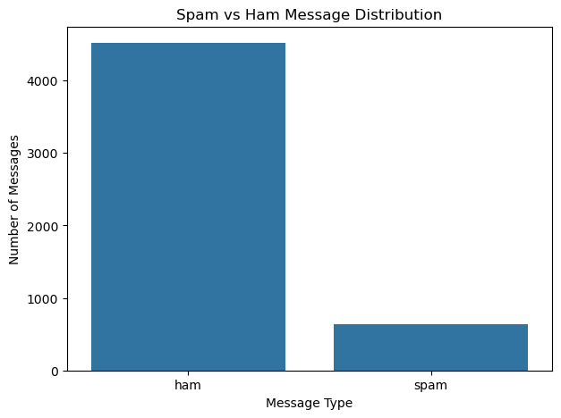
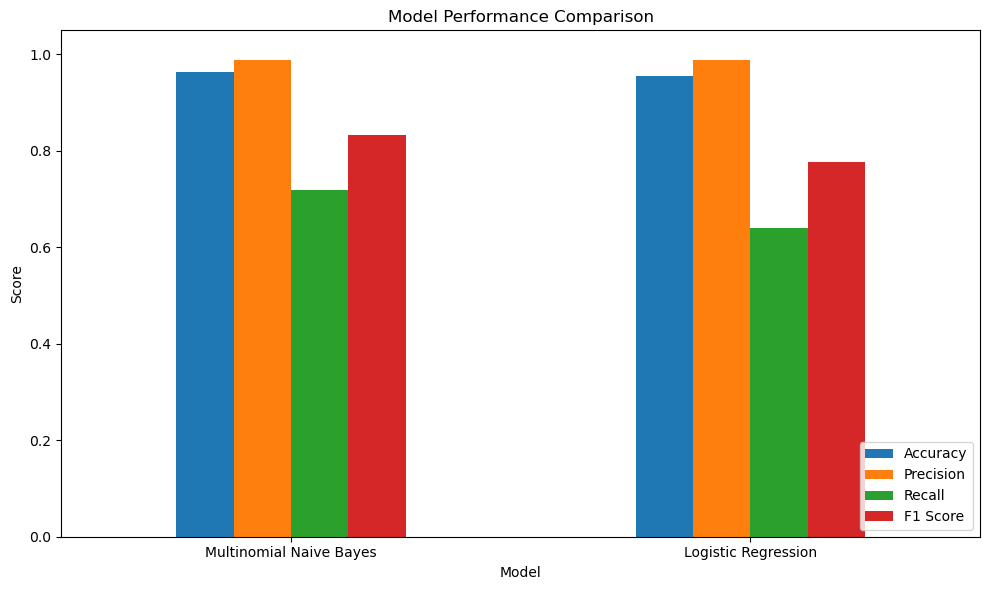
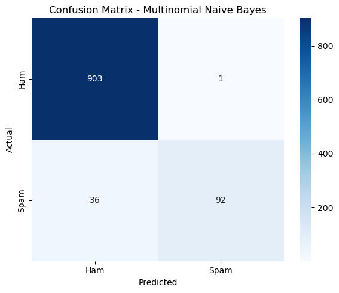
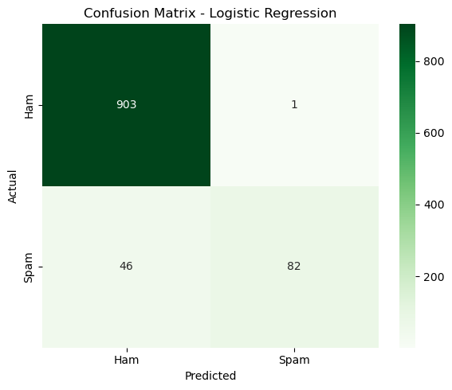
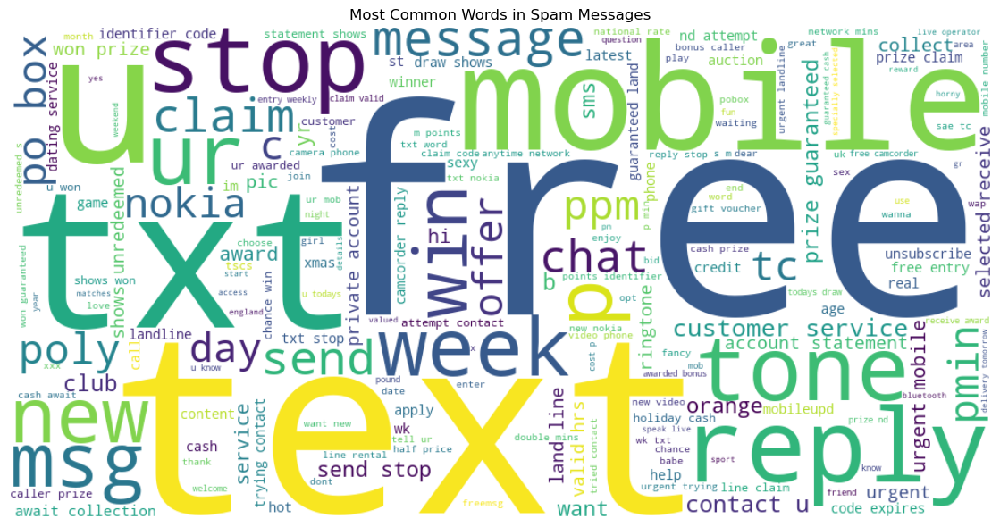
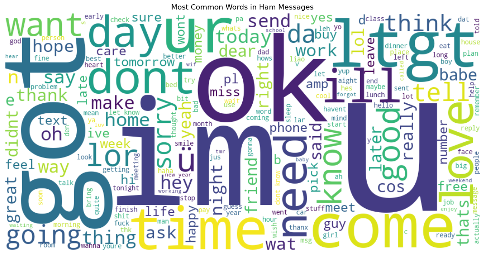
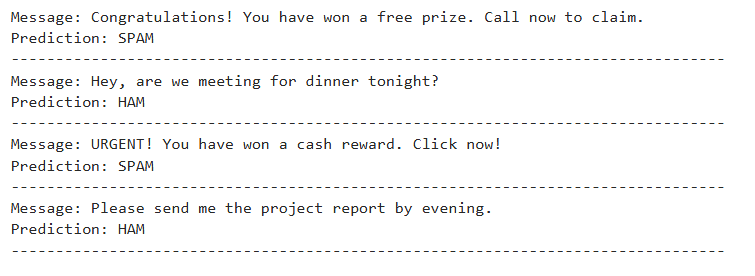

# 📧 Email Spam Detection with Machine Learning

<p align="center">
  
  
  
  
  
  
</p>

<p align="center">
  A Natural Language Processing project that classifies messages as <b>Spam</b> or <b>Ham</b> using Machine Learning.
</p>

---

## 📌 Overview

Spam messages are unwanted messages that may contain advertisements, scams, fraudulent offers, or suspicious links.

This project uses **Natural Language Processing (NLP)** and **Machine Learning** to automatically classify text messages into:

- 📩 **Ham** — Legitimate message
- 🚨 **Spam** — Unwanted or suspicious message

Two classification algorithms are trained and compared:

- **Multinomial Naive Bayes**
- **Logistic Regression**

---

## 🎯 Objectives

- Analyze Spam and Ham message distribution
- Clean and preprocess text data
- Remove punctuation, numbers, and stopwords
- Convert text into numerical features using **TF-IDF**
- Train two Machine Learning classification models
- Evaluate model performance
- Compare both models
- Generate confusion matrices
- Visualize common words using WordCloud
- Test the model on new messages

---

## 📂 Dataset

The project uses the **SMS Spam Collection Dataset** recommended for the Oasis Infobyte task.

| Column | Description |
|---|---|
| `label` | `ham` or `spam` |
| `message` | Text message |

### Dataset Statistics

| Metric | Value |
|---|---:|
| Original Records | 5,574 |
| Duplicate Records | 414 |
| Records After Cleaning | 5,160 |
| Ham Messages | 4,518 |
| Spam Messages | 642 |
| Ham Percentage | 87.56% |
| Spam Percentage | 12.44% |

The dataset is imbalanced because Ham messages are significantly more common than Spam messages.

### 📊 Class Distribution

<p align="center">
  
</p>

<p align="center"><i>Bar chart comparing the number of Ham vs Spam messages, showing the class imbalance in the dataset.</i></p>

---

## 🔄 Workflow

```text
Dataset
   ↓
Data Loading
   ↓
Data Inspection
   ↓
Duplicate Removal
   ↓
Text Preprocessing
   ↓
Stopword Removal
   ↓
Train-Test Split
   ↓
TF-IDF Feature Extraction
   ↓
Multinomial Naive Bayes
   ↓
Logistic Regression
   ↓
Model Evaluation
   ↓
Model Comparison
   ↓
New Message Prediction
```

---

## 🧹 Text Preprocessing

The following preprocessing steps are performed:

- Lowercase conversion
- Punctuation removal
- Number removal
- Extra space removal
- English stopword removal

**Example:**

```text
Original:
"Congratulations! You have won a FREE prize!!!"

Cleaned:
"congratulations won free prize"
```

---

## 🔤 TF-IDF Feature Extraction

TF-IDF (Term Frequency-Inverse Document Frequency) converts text into numerical features that Machine Learning models can process.

It gives higher importance to informative words and lower importance to words that appear frequently across many messages.

```python
TfidfVectorizer(
    max_features=5000,
    ngram_range=(1, 2)
)
```

### Configuration

| Parameter | Value |
|---|---|
| Maximum Features | 5,000 |
| N-gram Range | 1–2 |
| Unigrams | Individual words |
| Bigrams | Two-word combinations |

### Output

| Dataset | Shape |
|---|---|
| Training TF-IDF Shape | (4128, 5000) |
| Testing TF-IDF Shape | (1032, 5000) |

---

## 📊 Train-Test Split

The cleaned dataset is divided into training and testing datasets using an **80:20 split**.

| Dataset | Records |
|---|---:|
| Training Data | 4,128 |
| Testing Data | 1,032 |

The split uses `stratify=y` to maintain the Spam/Ham class distribution in both datasets.

---

## 🤖 Machine Learning Models

### 1. Multinomial Naive Bayes

Multinomial Naive Bayes is a probabilistic classification algorithm widely used for text classification.

It works efficiently with high-dimensional and sparse TF-IDF features.

### 2. Logistic Regression

Logistic Regression is a supervised classification algorithm used as an alternative model for comparison.

Both models are trained using the same TF-IDF features and evaluated on the same testing data.

---

## 📏 Evaluation Metrics

| Metric | Description |
|---|---|
| **Accuracy** | Measures the percentage of messages classified correctly |
| **Precision** | Measures how many messages predicted as Spam were actually Spam |
| **Recall** | Measures how many actual Spam messages were correctly detected |
| **F1 Score** | Provides a balance between Precision and Recall |
| **Confusion Matrix** | Shows True Positives, True Negatives, False Positives, and False Negatives |

---

## 📈 Model Performance

The models were evaluated on the test dataset.

| Model | Accuracy | Precision | Recall | F1 Score |
|---|---:|---:|---:|---:|
| Multinomial Naive Bayes | 96.41% | 98.92% | 71.88% | 83.26% |
| Logistic Regression | 95.45% | 98.80% | 64.06% | 77.73% |

<p align="center">
  
</p>

<p align="center"><i>Comparison chart of Accuracy, Precision, Recall, and F1 Score between Multinomial Naive Bayes and Logistic Regression.</i></p>

### Confusion Matrices

<table align="center">
  <tr>
    <td align="center">
      <br>
      <i>Multinomial Naive Bayes — Confusion Matrix</i>
    </td>
    <td align="center">
      <br>
      <i>Logistic Regression — Confusion Matrix</i>
    </td>
  </tr>
</table>

<p align="center"><i>Shows how many messages were correctly and incorrectly classified as Spam or Ham for each model (True Positives, True Negatives, False Positives, False Negatives).</i></p>

---

## 🏆 Best Performing Model

**Multinomial Naive Bayes** achieved the best overall performance in this project.

| Metric | Score |
|---|---:|
| Accuracy | 96.41% |
| Precision | 98.92% |
| Recall | 71.88% |
| F1 Score | 83.26% |

The Naive Bayes model achieved higher Accuracy, Precision, Recall, and F1 Score than Logistic Regression on the test dataset.

---

## 🎯 Why is Recall Important for Spam Detection?

Recall is particularly important in spam detection because it measures how many of the actual Spam messages are correctly identified.

A low Recall means that some Spam messages may be incorrectly classified as Ham.

Missing spam messages can allow:

- Phishing attempts
- Scam messages
- Fraudulent offers
- Unwanted advertisements
- Suspicious links

...to reach the user.

Therefore, an effective spam detection system should maintain a good balance between Recall and Precision.

---

## ☁️ WordCloud Analysis

<table align="center">
  <tr>
    <td align="center">
      <br>
      <i>🚨 Spam WordCloud</i>
    </td>
    <td align="center">
      <br>
      <i>📩 Ham WordCloud</i>
    </td>
  </tr>
</table>

### 🚨 Spam WordCloud

The Spam WordCloud displays frequently occurring words in Spam messages and helps identify common spam-related language patterns.

### 📩 Ham WordCloud

The Ham WordCloud displays frequently occurring words in legitimate messages and helps identify common communication patterns.

---

## 🧪 Sample Predictions

The trained Logistic Regression model was tested on new unseen messages.

| Message | Prediction |
|---|---|
| Congratulations! You have won a free prize. | 🚨 SPAM |
| Hey, are we meeting for dinner tonight? | 📩 HAM |
| URGENT! You have won a cash reward. | 🚨 SPAM |
| Please send me the project report by evening. | 📩 HAM |

<p align="center">
  
</p>

<p align="center"><i>Model output on new, unseen messages, showing predicted Spam/Ham labels.</i></p>

---

## 📁 Project Structure

```text
Email-Spam-Detection/
│
├── SMSSpamCollection.csv
│
├── Email_Spam_Detection.ipynb
│
├── screenshots/
│   ├── class_distribution.png
│   ├── naive_bayes_confusion_matrix.png
│   ├── logistic_regression_confusion_matrix.png
│   ├── model_comparison.png
│   ├── spam_wordcloud.png
│   ├── ham_wordcloud.png
│   └── sample_predictions.png
│
├── README.md
├── requirements.txt
```

---

## ⚙️ Installation

### Clone the Repository

```bash
git clone https://github.com/mohit-kanojiya/OIBSIP.git
```

### Navigate to the Project Directory

```bash
cd OIBSIP/Email-Spam-Detection
```

### Install Dependencies

```bash
pip install -r requirements.txt
```

---

## ▶️ How to Run

Start Jupyter Notebook:

```bash
jupyter notebook
```

Open:

```text
Email_Spam_Detection.ipynb
```

Run all notebook cells sequentially to reproduce the complete analysis, model training, evaluation, visualizations, and predictions.

---

## 📦 Requirements

The project uses the following Python libraries:

- pandas
- numpy
- matplotlib
- seaborn
- scikit-learn
- wordcloud
- jupyter
- notebook

All dependencies are listed in `requirements.txt`.

---

## 💡 Key Learnings

Through this project, I gained practical experience in:

- Natural Language Processing
- Text preprocessing
- Stopword removal
- TF-IDF feature extraction
- Binary text classification
- Multinomial Naive Bayes
- Logistic Regression
- Model evaluation
- Confusion Matrix analysis
- Precision and Recall
- F1 Score
- WordCloud visualization
- Model comparison
- Prediction on unseen text

---

## ⭐ Conclusion

This project demonstrates how Natural Language Processing and Machine Learning can be used to automatically classify messages as Spam or Ham.

Two Machine Learning models were trained and evaluated:

- Multinomial Naive Bayes
- Logistic Regression

Among the two models, **Multinomial Naive Bayes** achieved the best overall performance with:

**96.41% Accuracy | 98.92% Precision | 71.88% Recall | 83.26% F1 Score**

The project covers the complete workflow from data cleaning and text preprocessing to TF-IDF feature extraction, model training, evaluation, visualization, and new message prediction.

---

## 👨‍💻 Author

**Mohit Kanojiya**
