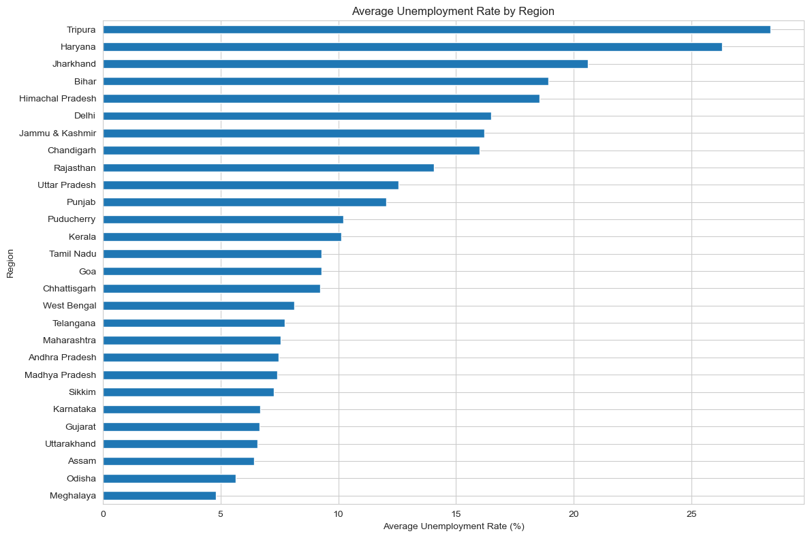
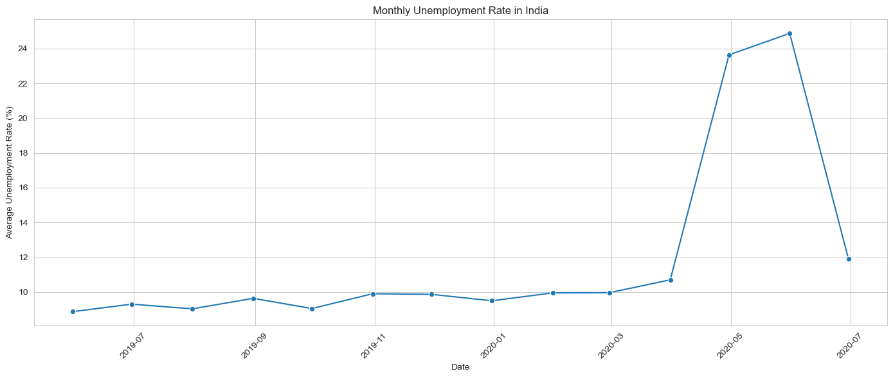
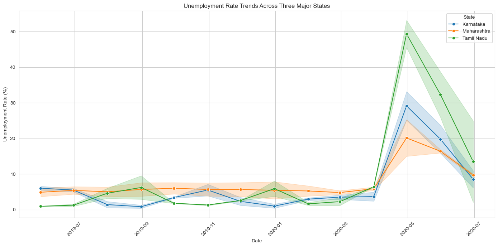
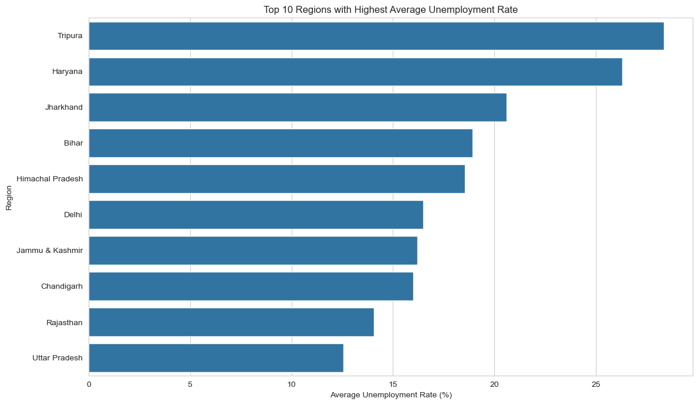
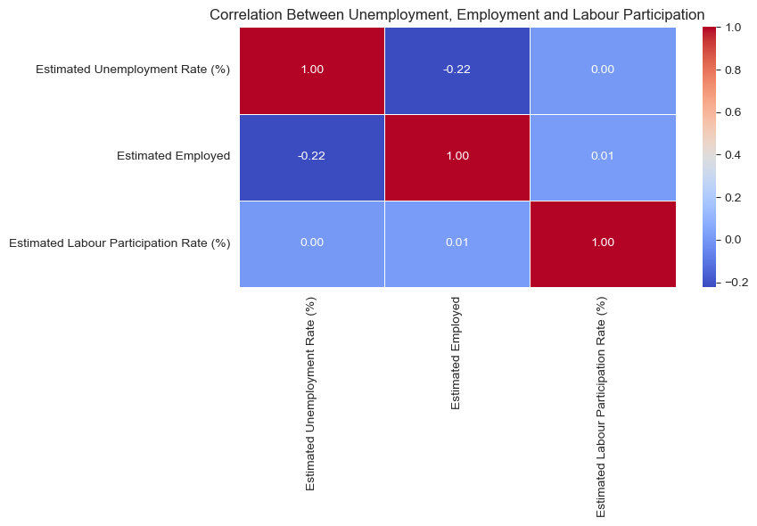
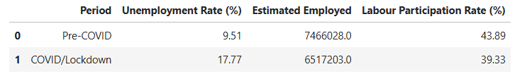
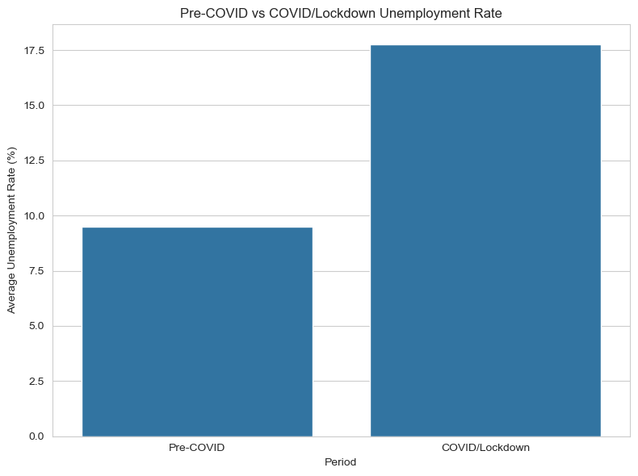

# 📊 Unemployment Analysis with Python

<p align="center">
  
  
  
  
  
  
</p>


---

## 🛠️ Tools & Technologies

| Category | Tools / Technologies |
|---|---|
| **Programming Language** | Python |
| **Data Manipulation** | Pandas, NumPy |
| **Data Visualization** | Matplotlib, Seaborn |
| **Development Environment** | Jupyter Notebook |
| **Version Control** | Git, GitHub |
| **Dataset Format** | CSV |

---

## 📌 Project Overview

This project focuses on performing **Exploratory Data Analysis (EDA)** on unemployment data in India.

The objective is to understand **regional and temporal trends in unemployment** and analyze the impact of the **COVID-19 lockdown period** on India's labour market.

The analysis covers unemployment rate, estimated employment, and labour participation rate across different regions of India.

---

## 🎯 Objectives

The main objectives of this project are:

- Analyze unemployment rates across different regions of India.
- Identify monthly unemployment trends.
- Compare unemployment trends across major states.
- Identify the top 10 regions with the highest average unemployment rate.
- Analyze the correlation between unemployment rate, estimated employment, and labour participation rate.
- Compare Pre-COVID and COVID/Lockdown unemployment conditions.
- Generate meaningful insights from the data.

---

## 📊 Dataset

**Dataset:** `Unemployment in India.csv`

The dataset contains the following columns:

- `Region`
- `Date`
- `Frequency`
- `Estimated Unemployment Rate (%)`
- `Estimated Employed`
- `Estimated Labour Participation Rate (%)`
- `Area`

### 📅 Dataset Information

| Information | Details |
|---|---|
| **Data Period** | May 2019 – June 2020 |
| **Original Records** | 768 |
| **Valid Records After Cleaning** | 740 |
| **Number of Regions** | 28 |
| **Number of Features** | 7 |

---

## 🧹 Data Cleaning & Preprocessing

The following preprocessing steps were performed:

1. Loaded the dataset using Pandas.
2. Inspected the dataset shape and column names.
3. Checked data types and statistical summary.
4. Removed leading and trailing spaces from column names.
5. Converted the `Date` column into datetime format.
6. Checked missing values.
7. Removed completely empty rows.
8. Converted numerical columns into appropriate numeric data types.
9. Verified the final dataset structure and date range.

---

# 📈 Exploratory Data Analysis

## 1. 🌍 Region-wise Average Unemployment Rate

The average unemployment rate was calculated for each region to identify regions with relatively higher and lower unemployment levels.

### 📸 Visualization



### 🔍 Observation

The analysis shows significant variation in unemployment rates across different regions of India.

**Tripura** recorded the highest average unemployment rate in the dataset, followed by Haryana, Jharkhand, Bihar and Himachal Pradesh.

---

## 2. 📅 Monthly Unemployment Trend

A time-series line chart was created to analyze how the average unemployment rate changed over time.

### 📸 Visualization



### 🔍 Observation

The unemployment rate remained relatively stable before the COVID-19 period.

A sharp increase can be observed during **April and May 2020**, showing the significant impact of the COVID-19 lockdown on unemployment in India.

---

## 3. 📍 Unemployment Trends Across Three Major States

Unemployment trends were compared across:

- Maharashtra
- Karnataka
- Tamil Nadu

### 📸 Visualization



### 🔍 Observation

All three states experienced noticeable changes in unemployment during the COVID-19 period.

The magnitude of the increase differed across the three states, with **Tamil Nadu showing a particularly large spike** during the lockdown period.

---

## 4. 🏆 Top 10 Regions with Highest Average Unemployment

The top 10 regions with the highest average unemployment rates were identified and visualized.

### 📸 Visualization



### 🔍 Observation

Tripura recorded the highest average unemployment rate among the regions analyzed, followed by Haryana, Jharkhand, Bihar and Himachal Pradesh.

This highlights significant regional differences in unemployment conditions across India.

---

## 5. 🔗 Correlation Analysis

A correlation heatmap was created to study the relationship between:

- Estimated Unemployment Rate
- Estimated Employed
- Estimated Labour Participation Rate

### 📸 Visualization



### 🔍 Observation

The correlation analysis shows a weak negative relationship between unemployment rate and estimated employment, with a correlation of approximately **-0.22**.

The relationship between unemployment rate and labour participation rate is close to zero in this dataset.

---

# 🦠 COVID-19 Impact Analysis

To understand the impact of COVID-19, the dataset was divided into two periods:

| Period | Date Range |
|---|---|
| 🟢 **Pre-COVID** | May 2019 – February 2020 |
| 🔴 **COVID/Lockdown** | March 2020 – June 2020 |

### 📊 COVID-19 Comparison

| Metric | Pre-COVID | COVID/Lockdown |
|---|---:|---:|
| **Average Unemployment Rate** | **9.51%** | **17.77%** |
| **Estimated Employed** | **7,466,028** | **6,517,203** |
| **Labour Participation Rate** | **43.89%** | **39.33%** |

### 📸 Comparison Table



### 📸 Comparison Chart



### 🔍 COVID-19 Observation

The average unemployment rate increased from **9.51% during the Pre-COVID period to 17.77% during the COVID/Lockdown period**.

This represents:

- **8.26 percentage-point increase**
- **86.91% relative increase** compared with the Pre-COVID level

At the same time, estimated employment decreased from approximately **7.47 million to 6.52 million**, while labour participation decreased from **43.89% to 39.33%**.

These results indicate a significant disruption in India's labour market during the COVID-19 lockdown period.

> **Note:** The dataset ends in June 2020. Therefore, this project analyzes the **COVID/Lockdown period** and does not claim to represent the long-term post-COVID period.

---

# 💡 Key Findings

- 📍 Unemployment rates varied significantly across Indian regions.
- 🏆 Tripura recorded the highest average unemployment rate in the dataset.
- 📈 Unemployment was relatively stable before COVID-19 and increased sharply during the lockdown.
- 🦠 April and May 2020 showed a major increase in unemployment.
- 📊 Maharashtra, Karnataka and Tamil Nadu experienced significant changes during the COVID-19 period.
- 📉 Estimated employment decreased during the COVID/Lockdown period.
- 📉 Labour participation also decreased during the COVID/Lockdown period.
- 🔥 The average unemployment rate increased by approximately **86.91% relative to the Pre-COVID level**.

---

# 📸 Project Visualizations

All major outputs are available in the `screenshots` folder.

| Visualization | File |
|---|---|
| Region-wise Unemployment | `region_wise_unemployment.png` |
| Monthly Unemployment Trend | `monthly_unemployment_trend.png` |
| Three-State Comparison | `three_state_comparison.png` |
| Top 10 Regions | `top_10_regions.png` |
| Correlation Heatmap | `correlation_heatmap.png` |
| Comparison Table | `comparison_table.png` |
| COVID Comparison | `covid_comparison.png` |

---

# 📁 Project Structure

```text
Unemployment_Analysis_with_Python/
│
├── Unemployment_Analysis.ipynb
├── Unemployment in India.csv
├── requirements.txt
├── README.md
│
└── screenshots/
    ├── region_wise_unemployment.png
    ├── monthly_unemployment_trend.png
    ├── three_state_comparison.png
    ├── top_10_regions.png
    ├── correlation_heatmap.png
    ├── comparison_table.png
    └── covid_comparison.png
```
---


# ▶️ How to Run the Project

### 1. Clone the Repository

git clone <YOUR_GITHUB_REPOSITORY_URL>

### 2. Open the Project Folder

cd Unemployment_Analysis_with_Python

### 3. Install Required Libraries

pip install -r requirements.txt

### 4. Launch Jupyter Notebook

jupyter notebook

### 5. Open the Notebook

Open: `Unemployment_Analysis.ipynb`

Run all cells from top to bottom to reproduce the complete analysis and visualizations.

---

# 📦 Requirements

The required Python libraries are listed in `requirements.txt`.

```text
pandas
numpy
matplotlib
seaborn
jupyter
```

---

# 👨‍💻 Author

## Mohit Kanojiya
